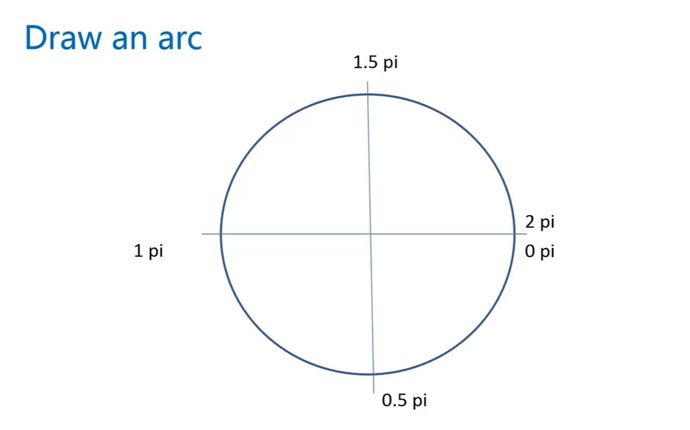

#### canvas的绘制圆弧
***

* 方法: context.arc(centerx, centery, radius, startingAngle, endingAngle, anticlockwise = false) centerx: 圆心的x坐标, 圆心的y坐标, radius: 半径, startingAngle: 起始角度，endingAngle: 结束角度，角度以pi为单位，anticlockwise: 以顺时针方向还是逆时针方向，默认顺时针方向  
  
使用实例:  
```typescript
(function() {
  const canvas = document.getElementById('canvas') as HTMLCanvasElement,
        ctx = canvas.getContext('2d')!;

  canvas.width = 1024, canvas.height = 768;

  ctx.lineWidth = 5;
  ctx.strokeStyle = '#005588';

// 01
  for ( let i = 0; i < 10; i++ ) {
    ctx.beginPath();
    ctx.arc( 50 + i * 100, 60, 40, 0, 2 * Math.PI * (i + 1) / 10);
    ctx.closePath();

    ctx.stroke();
  }

// 02 
  for ( let i = 0; i < 10; i++ ) {
    ctx.beginPath();
    ctx.arc(50 + i * 100, 180, 40, 0, 2 * Math.PI * (i + 1) / 10);

    ctx.stroke();
  }

// 03
  for ( let i = 0; i < 10; i++ ) {
    ctx.beginPath();
    ctx.arc( 50 + i * 100, 300, 40, 0, 2 * Math.PI * (i + 1) / 10, true);
    ctx.closePath();

    ctx.stroke();
  }

// 04
for ( let i = 0; i < 10; i++ ) {
  ctx.beginPath();
  ctx.arc(50 + i * 100, 420, 40, 0, 2 * Math.PI * (i + 1) / 10);

  ctx.stroke();
}
})()
```
效果图  

