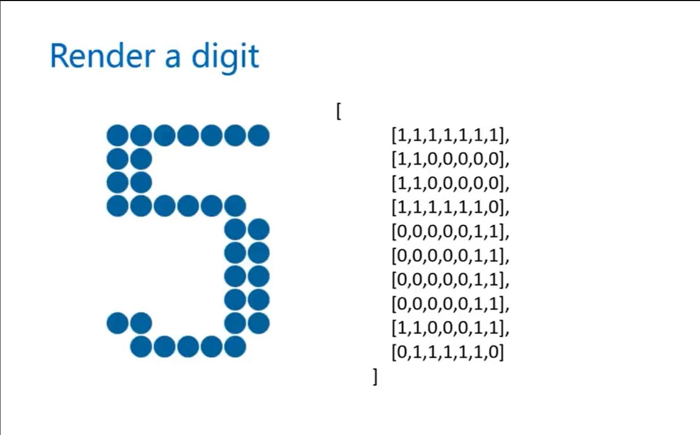
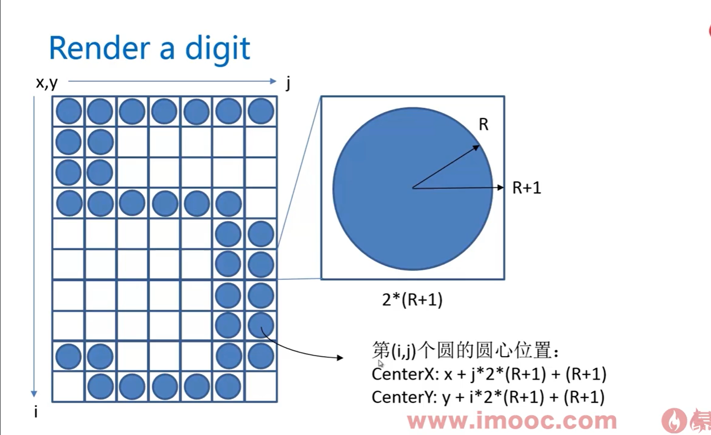

### 第三章 倒计时电子钟的实现
***

1. 阿拉伯数字的绘制: 用点阵实现数字的绘制,1绘制实心圆。
  
  

2. 获取倒计时的时，分，秒：设置个倒计时时间，如const endTime = new Date('2023-01-10 11:18:30')，再获取倒计时的毫秒数: endTime.getTime()，再获取当前时间的毫秒数：Date.now()。
  * 秒的计算: ((倒计时间 - 当前时间)/1000)%60
  * 分的计算: ((倒计时间 - 当前时间)/1000)/60
  * 时的计算: ((倒计时间 - 当前时间)/1000)/3600

3. 时，分，秒中间需要绘制冒号

具体代码如下:
```typescript
import digit from '../ts/digit'; // 数字与冒号的点阵

(function(digit) {
  const WINDOW_WIDTH = 1024,
        WINDOW_HEIGHT = 768,
        RADIUS = 8,
        MARGIN_LEFT = 30,
        MARGIN_TOP = 60,
        canvas = document.getElementById('canvas') as HTMLCanvasElement,
        context = canvas.getContext('2d') as CanvasRenderingContext2D;
  
  const endTime = new Date('2023-01-09 10:20:35');
  let curShowTimeSeconds = 0;

  canvas.width = WINDOW_WIDTH;
  canvas.height = WINDOW_HEIGHT;

  curShowTimeSeconds = getCurrentShowTimeSeconds();

  render( context );

  function render( cxt: CanvasRenderingContext2D ) {
    const hours = parseInt( String(curShowTimeSeconds / 3600), 10 ),
          minutes = parseInt( String((curShowTimeSeconds - hours * 3600)/60), 10 ),
          seconds = curShowTimeSeconds % 60;
   
    // 小时
    renderDigit(MARGIN_LEFT, MARGIN_TOP, parseInt( String(hours/10) ), cxt);
    renderDigit(MARGIN_LEFT + 15 * (RADIUS + 1), MARGIN_TOP, parseInt(String(hours % 10)), cxt);
    renderDigit( MARGIN_LEFT + 30 * (RADIUS + 1), MARGIN_TOP, 10, cxt);                                        // 给制冒号:
    // 分
    renderDigit( MARGIN_LEFT + 39 * (RADIUS + 1), MARGIN_TOP, parseInt(String(minutes / 10)), cxt);
    renderDigit( MARGIN_LEFT + 54 * (RADIUS + 1), MARGIN_TOP, parseInt(String(minutes % 10)), cxt);
    renderDigit( MARGIN_LEFT + 69 * (RADIUS + 1), MARGIN_TOP, 10, cxt);
    // 秒
    renderDigit( MARGIN_LEFT + 78 * (RADIUS + 1), MARGIN_TOP, parseInt(String(seconds / 10)), cxt);
    renderDigit( MARGIN_LEFT + 93 * (RADIUS + 1), MARGIN_TOP, parseInt(String(seconds % 10)), cxt);

  }

  function renderDigit(x: number, y: number, num: number, cxt: CanvasRenderingContext2D) {
    cxt.fillStyle = 'rgb(0, 102, 153)';

    for (let i = 0; i < digit[num].length; i++ ) {
      for (let j = 0; j < digit[num][i].length; j++) {
        if (digit[num][i][j] == 1) {
          cxt.beginPath();
          cxt.arc( x + j * 2 * (RADIUS + 1) + (RADIUS + 1), y + i * 2 * (RADIUS + 1) + (RADIUS + 1), RADIUS, 0, 2 * Math.PI);
          cxt.closePath();
          cxt.fill();
        }
      }
    }
  }

  function getCurrentShowTimeSeconds(): number {
    const curTime = new Date();
    let ret = endTime.getTime() - curTime.getTime();
    ret = Math.round( ret / 1000 );

    return ret >= 0 ? ret : 0;
  }
})(digit)
```