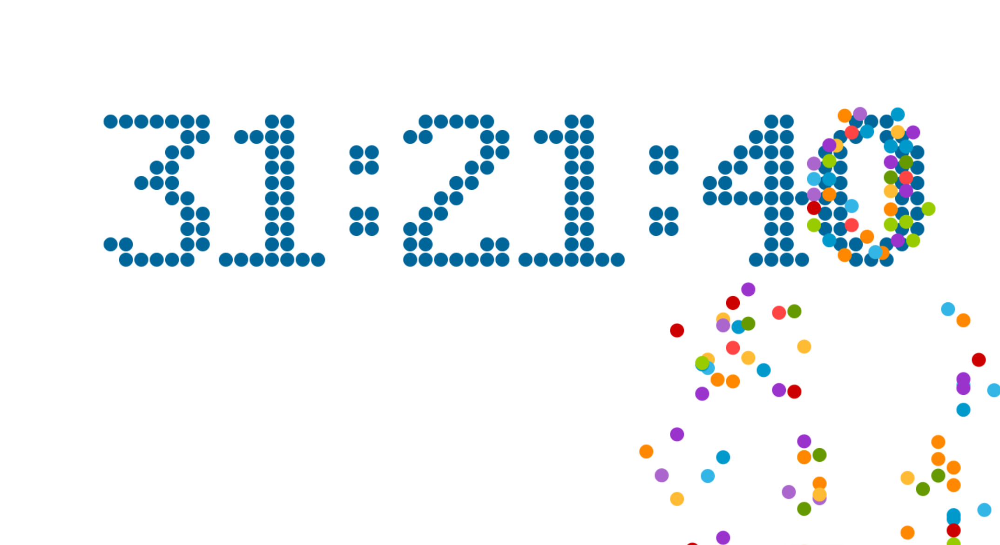

### 4-3 华丽小球滚动效果
***



1. 设置小球的数据类型与小球颜色
```typescript
  // 设置小球的数据类型
  type BallType = {
    x: number,
    y: number,
    g: number,
    vx: number,
    vy: number,
    color: string
  };
  // 设置小球的颜色
  const balls: Array<BallType> = [],
        colors = ['#33B5E5','#0099CC','#AA66CC','#9933CC','#99CC00','#669900','#FFBB33','#FF8800','#FF4444','#CC0000'];
``` 

2. 时间变化时添加小球个数
```typescript
    if ( nextSeconds !== curSeconds ) {
      // 设置变动的小球
      if ( parseInt( String(curHours/10) ) != parseInt( String(nextHours/10) ) ) {
        addBalls( MARGIN_LEFT + 0, MARGIN_TOP, parseInt(String(curHours/10)) );
      }
      if ( parseInt( String(curHours%10) ) != parseInt( String(nextHours%10) ) ) {
        addBalls( MARGIN_LEFT + 15 * (RADIUS + 1), MARGIN_TOP, parseInt( String(curHours/10) ) );
      }

      if( parseInt( String(curMinutes/10) ) != parseInt( String(nextMinutes/10) ) ){
        addBalls( MARGIN_LEFT + 39 * (RADIUS+1) , MARGIN_TOP , parseInt( String(curMinutes/10) ) );
      }
      if( parseInt( String(curMinutes%10) ) != parseInt( String(nextMinutes%10) ) ){
        addBalls( MARGIN_LEFT + 54 * (RADIUS+1) , MARGIN_TOP , parseInt( String(curMinutes%10) ) );
      }

      if( parseInt( String(curSeconds/10) ) != parseInt( String(nextSeconds/10) ) ){
        addBalls( MARGIN_LEFT + 78 * (RADIUS+1) , MARGIN_TOP , parseInt( String(curSeconds/10) ) );
      }
      if( parseInt( String(curSeconds%10) ) != parseInt( String(nextSeconds%10) ) ){
        addBalls( MARGIN_LEFT + 93 * (RADIUS+1) , MARGIN_TOP , parseInt( String(nextSeconds%10) ) );
      }

      curShowTimeSeconds = nextShowTimeSeconds;
    }
```

3. 添加小球的方法
```typescript
  /**
   * 添加小球方法
   * params x: 小球x轴的位置
   * params y: 小球y轴的位置
   * params num: 小球数量 
  */
  function addBalls( x: number, y: number, num: number) {
    for ( let i = 0, len = digit[num].length; i < len; i++ ) {
      for ( let j = 0, length = digit[num][i].length; j < length; j++ ) {
        if ( digit[num][i][j] === 1 ) {
          const aBall: BallType = {
            x: x + j * 2 * (RADIUS + 1) + (RADIUS + 1),
            y: y + i * 2 * (RADIUS + 1) + (RADIUS + 1),
            g: 1.5 + Math.random(),
            vx: Math.pow(-1, Math.ceil(Math.random() * 1000)) * 4,            // -1多少次方, [-1, 1], 偶数次方为1, 奇数次方为-1
            vy: -5,
            color: colors[ Math.floor(Math.random() * colors.length) ]
          };

          balls.push( aBall );
        }
      }
    }
  }
```

4. 更新小球，在update()方法中更新小球
```typescript
  function updateBalls( ) {
    for ( const obj of balls ) {
      obj.x += obj.vx;
      obj.y += obj.vy;
      obj.vy += obj.g;

      // 边界判断
      if ( obj.y >= WINDOW_HEIGHT - RADIUS ) {
        obj.y = WINDOW_HEIGHT - RADIUS;
        obj.vy =- obj.vy * 0.75;
      }
    }
  }
```

5. 在render方法中绘制小球
```typescript
    // 生成动画小球
    for ( const ball of balls ) {
      ctx.fillStyle = ball.color;

      ctx.beginPath();
      ctx.arc( ball.x, ball.y, RADIUS, 0, 2 * Math.PI, true);
      ctx.closePath();

      ctx.fill();
    }
```

[代码地址](https://github.com/tonyshu168/canvans_countdown/tree/chapter05-01)